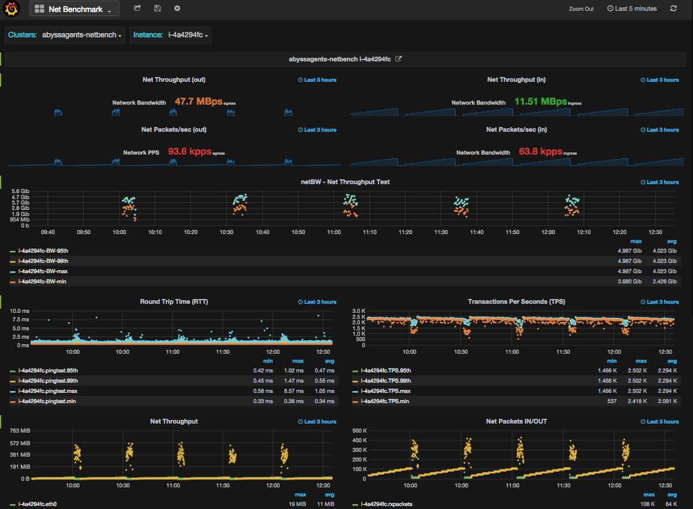
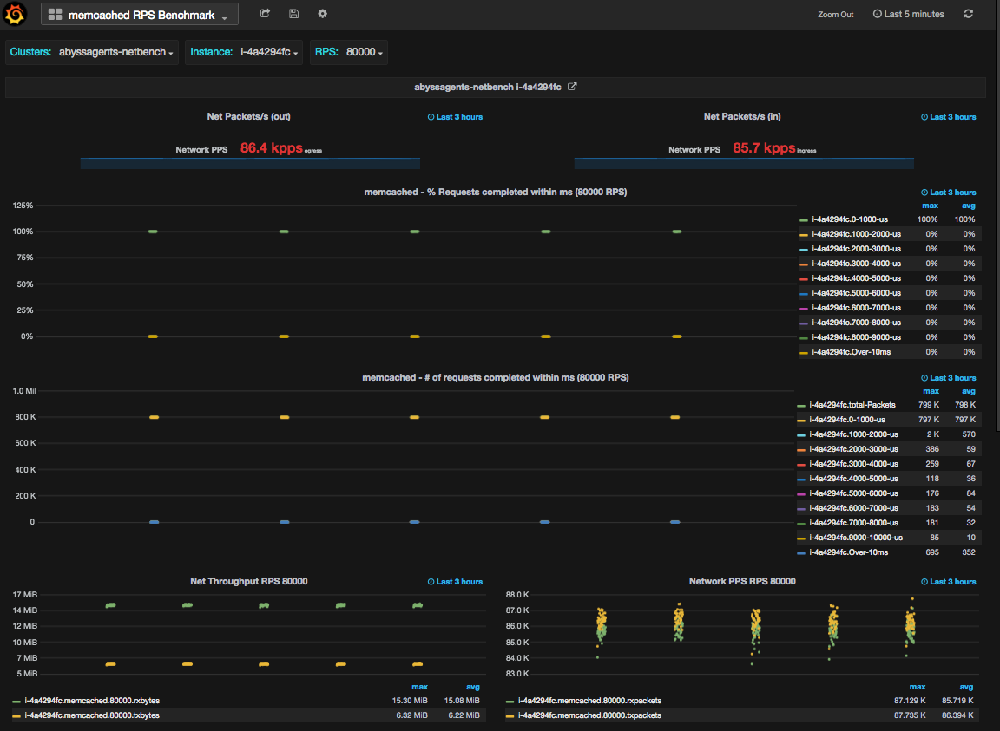

Abyss is a toolset developed to solve performance issues requiring deeper analysis. To estimate resource demand of complex workload, it is essential to have access to low level profiling data captured at proper granularity. Abyss is designed to understand application characteristics by measuring access patterns across full software stack. Correlation is then performed across multiple resource dimensions to identify resource constraints limiting application performance. Abyss toolset provides access to low level profiling data captured at higher resolution. 

## Abyss Design

Abyss agents run on cloud instance capture application and system level metrics and periodically push them to a graphite server. 
Sample dashboards created using Grafana (available in Dashboard folder) to visualize metrics and to perform data correlation.

Abyss relies on following components to function:

- Agents: Agents run on the instance and are written using perl, python and C.
  - **App:** App agents capture java application and jvm metrics via JMX port on localhost. Cassandra agent is available. Kafka, ES and 
        Tomcat agents are planned
  - **System:** System agent captures system metrics: cpu, mem, net, io
  - **Sniffer:** Sniffer agents captures low level per connection tcp metrics and IO latency metrics
  - **Benchmark:** benchmarking agents to automate the process of running benchmarks and collecting relevent metrics. 
- Graphite Server: All agents periodically (default: every 5 seconds) ship metrics to graphite server. 
- Visualization: Grafana is used for creating dashboards. Sample dashboards are available in Dashboard folder
- ElasticSearch: Dashboards are saved on ES for quick retrieval.

There is a master startup scripts (startMonitoring) available to start application and system agents.

$./startMonitoring

This will start Metrics accumulation in graphite server. Wait for few minutes to have sufficient metrics displayed on the dashboard. 

Similarly, If interested in benchmarking (network benchmark test-suite is available), start network benchmarks using a master script, 

$./startBenchmark (Requires peer host name/IP address; netserver process and memcached process running on peer on required ports

## Abyss In Action
- **Application Dashboard**
 
- **System Dashboard**
 
- **Benchmark Dashboard**
 

## Metrics
 List of metrics collected by abyss toolset:
- System Metrics: 
  - **cpu:** cpu and percpu utilization: idle, sys, usr, intr, cpu load: runnable and blocked threads, context switches
  - **memory:** free (unused), free (cached) and used memory
  - **network:** system-wide Network throughput, pps, tcp segments, tcp timeouts, per connection stats: Network throughput, Latency (RTT), retransmit, packet size, ssthresh, cwnd, rwnd, read/write queue size
  - **io:** system-wide IO throughput, IOPS, IO latency and IO size

- Application Metrics:
  - **cassandra**
    - coordinator and C* column family read and write latency
    - IOPS coordinator and C* column family read and write Ops
    - Pending Tasks: Type of Tasks pending completion: compaction, hintedhandoff, readstage, etc..
    - compaction: total bytes compacted, memtable size and memtable switch rate
    - sstable stats, sstable cached in memory, sstable sizes and sstable counts
    - java memory Heap and non heap usage
    - GC garbage collection duration

- Benchmark Metrics
  - **ping -A:** measure net latency. Adoptive ping that adopts to RTT. There can only be one unanswered probe pending at any time. Lower value (RTT) is better representing lower network latency
  - **netperf:** measure net latency: TCP request response test with request/response payload of 1 byte. There can be only one transaction pending at any time. Higher number of transactions (TPS) is better representing lower network latency
  - **netperf:** measure net throughput. TCP throughput test with message size equals to the default socket buffer size, Amazon AWS cloud instances are throttled for outbound traffic. This test validates if the instance is achieving amazon advertise instance network bandwidth limit. Higher number is better.
  - **memcache:** measure net latency: Open source memcached client "mcblaster" is used to warm up the memcached server cache with 2 Million 100 bytes records. mcblaster client then performs 10k, 20k, 30k,... 80k gets/sec transactions to measure latencies. At the end of test, transactions completed within 1-10 ms are bucketed in 1ms increments. Tests showing higher number of gets operations in low latency buckets is better. To measure the impact of high rate get/second request, ping and netperf latency tests were kept running during the memcache testing.

To interpret benchmark visualization correctly, it is important to understand how data points (metrics) in the graph are generated:
  - For ping and netperf tests, I calculated min, max, 95th and 99th%ile on latency and throughput values printed during tests and then published them as metric. That means, every data point in the graph represents a single test result. Each test ran for 5-10 seconds
  - For memcached tests, I use the name/value of the bucket as a metric printed after the test ends. Each test ran for 10 seconds. Every data point in the graph represent a single test result. For memcached tests, "gets" RPS of 70k were used to measure its impact on overall Network latency.

## Future Enhancements
- Support for new Applications: kafka, tomcat, Elasticsearch
- Support for low level kernel metrics collected using: perf, ftrace, systemtap, sysdig  
- Support influxDB instead of Graphite. InfluxDB can be sharded and scale better than Graphite
- Support for collecting java and system stack using perf and accumulating it into influxDB or Graphite for visualization using Brenden Gregg's Flame Graph
- Support additional benchmarks: IO, CPU, Memory and Application specific benchmarks
- Better visualization by using new features and enhancement introduced in grafana

## Disclaimer
Use it at your own risk. 

## License

Licensed under the Apache License, Version 2.0 (the “License”); you may not use this file except in compliance with the License. You may obtain a copy of the License at

[http://www.apache.org/licenses/LICENSE-2.0](http://www.apache.org/licenses/LICENSE-2.0)

Unless required by applicable law or agreed to in writing, software distributed under the License is distributed on an “AS IS” BASIS, WITHOUT WARRANTIES OR CONDITIONS OF ANY KIND, either express or implied. See the License for the specific language governing permissions and limitations under the License.
