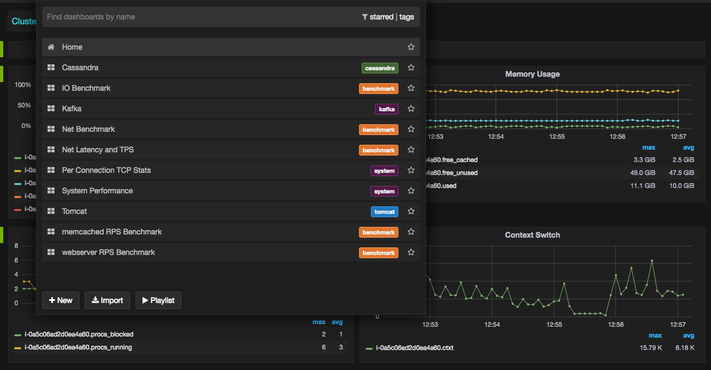

## Abyss Features

- Collects system and application level performance metrics at a higher resolution
- Helps automate benchmarks and interpret results 
- Use time-series graphite database to store metrics
- Query metrics for visualization via Grafana graph and dashboard builder. http://grafana.org/
- Custom ready to use Dashboards are available for: system, cassandra, kafka, tomcat, nfs and benchmark results.
- Abyss design fits well into self service model
- Capture metrics across full software stack: application, JVM, system, network, and kernel. 
- Higher granularity of metrics helps identify resource usage spikes and constraints
- Low level profiling data to understand application characteristics better
- Data correlation via custom dashboards

## Abyss Model

Abyss has following components:
- **Time-Series Database:** All agents ship metrics to graphite server. Support is planned for ES, Cloudwatch, influxDB
- **Jolokia:** Captures JVM metrics via JMX port on localhost for Java applications: Cassandra, Kafka, Tomcat
- **Visualization:** Grafana is used for querying metrics and designing dashboards
- **Agents:** Run on instance under investigation and generate metrics:  
  - *System Agents:* Collect system  metrics: cpu, memory, net, tcp, io, nfs
  - *Application Agents:* Collect application metrics: Cassandra, kafka, Tomcat. 
  - *Sniffer Agents:* Collect low level tcp and io metrics via open source tcpip driver and Linux “perf” utility.
  - *Benchmark Agents:* Automate IO and Network benchmarking and graphing results:  Net, IO, memcache, web  

## Abyess Agents Design
- Abyss agents are simple to write and language agnostic.
- Basic requirement is to collect metrics and dump them to graphite server periodically.
- There are sample agents written in Perl are available.
- Mtrics are sent in “.” formatted string with time stamp to graphite carbon server: $server.$host.system.mem.free_cached $free_cached $datestamp, where:
  - *metrics name:* $server.$host.system.mem.free_cached 
  - *metrics value:* $free_cached 
  - *timestamp:* $datestamp
- For graphing metrics, open source grafana dashboard builder is used to query metrics and to design custom dashboards. Sample and ready to use Dashboards are available. 
- Grafana is feature rich and support: 
 - Several time-series data sources: Elasticsearch, Cloudwatch, InfluxDB ..
 - Templating Variables automatically filled with values from database
 - Snapshot sharing of interactive graphs

## Abyss Setup 

Clone the repository: $ git clone https://github.com/aather/abyss

**There is a script, graphite-setup/graphite-setup.sh, provided to test Abyss quickly on a single Ubuntu server. Script sets up server side of Abyss. It installs and configures services: graphite, grafana, apache that Abyss agents use for storing and quering metrics on localhost** 

Start system monitoring agents: **$./startMonitoring**

*This will start abyss agents to collect metrics at 5 second interval and push them to graphite server on the network.* 
*Wait for few minutes to have sufficient metrics collected so they can be displayed on dashboard.*

**Enter URL of grafana server. By default, it is running on localhost**
 http://localhost:7410/

For full setup, use abyss agents configuration file: **env.pl** . This file sets up environment variables for all abyss agents. 

 - **carbon_server-**    Agents ships metrics to graphite server on this host. Default locahost
 - **carbon_port-**      Agent sends request to this Port number where carbon server is listening. Default: 7405
 - **grafana_port-**	 Port where grafana server is listening. Default: http://localhost:7410/
 - **host-**             Sets hostname or Amazon cloud instance id: i-c3a4e33d. Metrics are stored under this hostname
 - **server-**           Sets Server name or Application cluster name, used by graphite server for storing metrics. 
 - **interval-**         Sets metrics collection granularity. Default: 5 seconds
 - **iterations-**	 Sets number of benchmark iterations to perform. Default: 5 seconds

## Abyss Benchmark Agents
To run network Benchmark set environment variables in **env.pl** file to set peer host running netserver, webserver or/and memcached servers. Install and start netserver, webserver (nginx, apache) and memcached server with options below:
- peer = "peer IP address or hostname" 
- netserver: sudo netserver -p 7420
- memcached: $sudo memcached -p 7425 -u nobody -c 32768 -o slab_reassign slab_automove -I 2m -m 59187 -d -l 0.0.0

To start Network throughput benchmark, run:
$./startNetBenchmark 

## Abyss In Action

## Abyss Metrics
 List of metrics collected by abyss agents:
- System Metrics: 
    - **cpu:**  cpu and percpu utilization: idle, sys, usr, intr, cpu load: runnable and blocked threads, context switches
    - **memory:**  free (unused), free (cached) and used memory
    - **network:** system-wide Network throughput, pps, tcp segments, tcp timeouts, per connection stats: Network throughput, Latency (RTT), retransmit, packet size, ssthresh, cwnd, rwnd, read/write queue size
    - **io:** system-wide IO throughput, IOPS, IO latency and IO size
- Application Metrics:
  - **cassandra**
    - JVM metrics: GC, heap and nonheap memory 
    - coordinator and Cassandra column family IO latency and IOPS
    - Pending Tasks: Type of Tasks pending completion: compaction, hintedhandoff, readstage, etc..
    - compaction: total bytes compacted, memtable size and memtable switch rate
    - sstable stats, sstable cached in memory, sstable sizes and sstable counts
  - **kafka**
    - 
  - **tomcat**
    - 
- Benchmark Metrics:
  Benchmark agents can automate running IO and Network benchmark and graphing results. Thousands of iterations can be performed:
    - **ping -A:** measure net latency. Adoptive ping that adopts to RTT. There can only be one unanswered probe pending at any time. Lower value (RTT) is better representing lower network latency
    - **netperf:** measure net latency: TCP request response test with request/response payload of 1 byte. There can be only one transaction pending at any time. Higher number of transactions (TPS) is better representing lower network latency
    - **netperf:** measure net throughput. TCP throughput test with message size equals to the default socket buffer size, Amazon AWS cloud instances are throttled for outbound traffic. This test validates if the instance is achieving amazon advertise instance network bandwidth limit. Higher number is better.
    - **memcache:** measure net latency: Open source memcached client "mcblaster" is used to warm up the memcached server cache with 2 Million 100 bytes records. mcblaster client then performs "gets" request at various RPS rates and measure memcache latencies. At the end of test, transactions completed within 1-10 ms are bucketed in 10ms increments.
    - **webserver:** Open source "wrk" client is used to run RPS test again nginx or any other web server

 *NOTE: Every data point in the graph represents a single test result. Considering Tests duration can be more than 5 seconds, Time 
scale in graph is fabricated to keep data points to look like generated every 5 seconds. This is to keep time series database happy* 

## Future Enhancements
- Web browser interface instead of config file "env.pl" to setup and start metric collection
- Support for new Applications
- Support for low level kernel metrics collected using: perf, ftrace, ebpf, systemtap, sysdig  
- Generate metrics in the format supported by other datasources: influxDB, ElasticSearch and Cloudwatch 
- Support for collecting time based application and system stacktraces using perf and accumulating it into ElasticSearch, influxDb  or Graphite for visualization using Brenden Gregg's Flame Graph. Perf makes it possible to have full stack analysis capability by collecting stack traces with Java (JIT), JVM, libc, and kernel routines. 

## Disclaimer
Use it at your own risk. Net benchmarks agents may cause high load and IO benchmark may overwrite and recreate a file system. Tested on Linux Ubuntu distribution only.  

## License

Licensed under the Apache License, Version 2.0 (the “License”); you may not use this file except in compliance with the License. You may obtain a copy of the License at

[http://www.apache.org/licenses/LICENSE-2.0](http://www.apache.org/licenses/LICENSE-2.0)

Unless required by applicable law or agreed to in writing, software distributed under the License is distributed on an “AS IS” BASIS, WITHOUT WARRANTIES OR CONDITIONS OF ANY KIND, either express or implied. See the License for the specific language governing permissions and limitations under the License.
