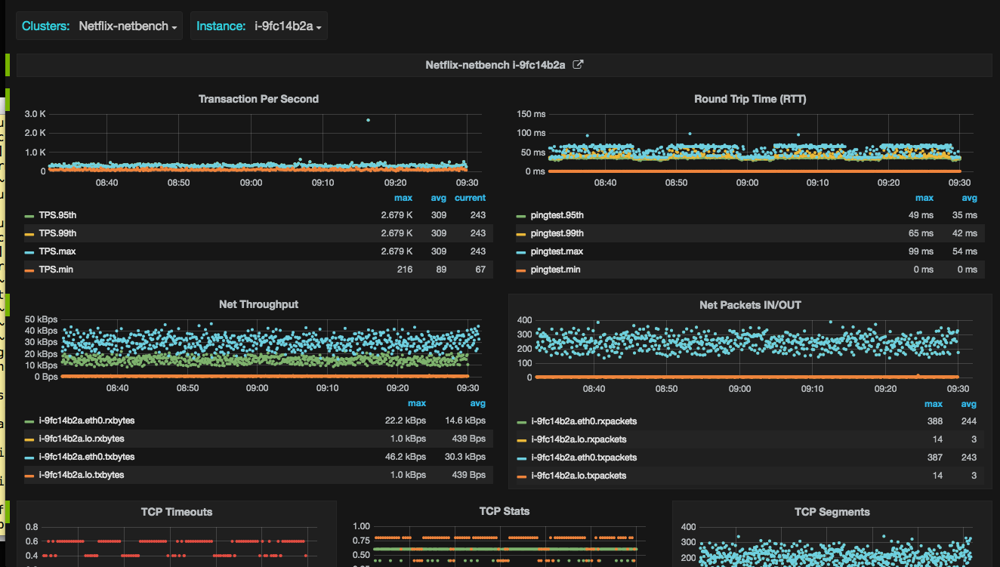

## Abyss Features

- Collects system and application level performance metrics at a higher resolution
- Helps automate benchmarks and interpret results 
- Use time-series graphite database to store metrics
- Query metrics for visualization via Grafana graph and dashboard builder. http://grafana.org/
- Ready to use Dashboards to display: 
  - System metrics: io, net, cpu, tcp, nfs  
  - Low level metrics (captured via Linux perf):per tcp connection, io size and io latency
  - Application metrics: cassandra, kafka, and tomcat. 
  - Benchmark metrics: Captures critical benchmark metrics: webserver, memcache, Network and IO throughput, TPS and Latency 
- Abyss design fits well into self service model
- Capture metrics across full software stack: application, JVM, system, network, and kernel. 
- Higher granularity of metrics helps identify resource usage spikes and constraints
- Low level profiling data to better understand application characteristics.
- Data correlation via custom dashboards.
- Fits well into self service model.  

## Abyss Model

Abyss has following components:
- **Time-Series Database:** All agents ship metrics to graphite server. Support is planned for ES, Cloudwatch, influxDB
- **Jolokia:** Captures JVM metrics via JMX port on localhost for Java applications: Cassandra, Kafka, Tomcat
- **Agents:** Run on instance. Capture metrics and ship them to graphite server  
- **Visualization:** Grafana is used to query metrics from graphite datasource and to build custom dashboards

## Abyess Agents Design
- Abyss agents are simple to write and language agnostic.
- Basic requirement is to collect metrics and dump them to graphite server periodically.
- There are sample agents written in perl and python are available.
- Metrics are sent in “.” formatted string with time stamp to graphite carbon server: $server.$host.system.mem.free_cached $free_cached $datestamp, where:
  - *metrics name:* $server.$host.system.mem.free_cached 
  - *metrics value:* $free_cached 
  - *timestamp:* $datestamp
- For graphing metrics, open source grafana dashboard builder is used to query metrics and to design custom dashboards. Sample and ready to use Dashboards are available. 
- Grafana is feature rich and support: 
 - Several time-series data sources: Elasticsearch, Cloudwatch, InfluxDB ..
 - Templating Variables automatically filled with values from database
 - Snapshot sharing of interactive graphs

## Abyss Setup 

Clone the repository: $ git clone https://github.com/aather/abyss

It is prefered to clone it on multiple servers of any type: VirtualBox, docker, Cloud Instance, Bare-matel ..


**Backend Setup:** Abyss depends on graphite, apache and grafana server. To make it simple to configure and test, script,graphite-setup.sh, is provided that installs and configures all three services (graphite, grafana, apache) on a single server. To run it, type:``` 
 $cd abyss/graphite-setup 
 $sudo -s 
 #./graphite-setup.sh 
[Note: script is tested on Ubuntu Trusty only]
```

**Agent Setup:**  Abyss agents are used for collecting metrics. All agents use **env.pl** file for configuration. Update the file with IP address or hostname of server running graphite service so that agents can send metrics to it. Search for string:

**$carbon_server = "IPAddr of graphite server";           # graphite serverr
..

Save changes and then start system monitoring agent by running: **$./startMonitoring**

*This is a wrapper script that starts system monitoring agents to collect system and low level IO latency and per connection tcp metrics. Metrics are collected at 5 second (default) interval and pushed to graphite server on the network. 

Wait for few minutes to have sufficient metrics collected and then enter URL to display graphs:

**http://hostname:7410/**      

Hostname or IP addres of grafana server. As discussed above, all three services (graphite, grafana and apache) are installed and running on the same server. You will find several ready to use dashboards. 

Click **"System Performance"** Dashboard to see graphs of system metrics.

Click **"Per Connection TCP Stats"** Dashboard to see graphs of per TCP connection stats metrics.


**env.pl** file sets up environment variables for all abyss agents. 
```
 carbon_server   	Agents ships metrics to graphite server on this host. Default locahost. Y
 carbon_port     	Agent sends request to this Port number where carbon server is listening. Default: 7405
 grafana_port		Port where grafana server is listening. Default: http://hostname:7410/
 host            	Sets hostname or Amazon cloud instance id: i-c3a4e33d. Metrics are stored under this hostname
 server          	Sets Server name or Application cluster name, used by graphite server for storing metrics. 
 interval      		Sets metrics collection granularity. Default: 5 seconds
 iterations             Applies to benchmark agents. Sets iterations to perform. Default: 10
 peer            	Applies to Net benchmark
```

There are abyss agents to collect JAVA JMX metrics using java agents that connects to JMX port on demand on the localhost to collect metrics. At this point Cassandra, Kafka and Tomcat Java and JVM metrics are reported 


## Abyss Benchmark Agents

There are agents provided to automate benchmarks:

**Network Throughput and TPS Benchmark**

Abyss agents run Network throughput and TPS benchmarks using netperf tool. You need to install netserver on the peer host by running:

$ sudo apt-get install -y netserver

Make sure netserver listens on port 7420 on peer host. Otherwise, you may have to change default ports in env.pl file

$ sudo netserver -p 7420

Update **env.pl** file where abyss agents are running so that they can generate traffic against the server:
- peer = "peer IP address or hostname"   
where $peer is the hostname where netserver is running

NetworkAgent connects to netserver via netperf on following default ports:
```
  net_dport = 7420;                      Agent  will use this netserver data port on peer
  net_cport = 7421;                      Agent  will use this netserver control port on peer
  net_rport = 7422;                      Aagent will use this netserver port for net latency test
```
collect system metrics on both netserver system ($peer) and the system running benchmark agents to generate load:

$./startMonitoring.sh

Now start the benchmark agents on a system that is used to generate load against the peer server:

To start network throughput benchmark, type:
$./startNetTputBenchmark.sh 

To start network TPS benchmark, type:

$./startNetTPSBenchmark.sh

[NOTE: It is recommended to use "screen" program and run it from screen window. This allows one to run benchmark agents in the background] 

Benchmark agents  runs the benchmark, collects important metrics from the test results and push them to graphite server. You can then use grafana dashboard to query and graph benchmark metrics. Enter URL in broswer 

**http://hostname:7410/**

Click: **Net Benchmark** Dashboard

Click **Net Latency and TPS** Dashboard


**IO Throughput and Latency Benchmark**

Abyss agent run IO benchmarks using fio tool. Make sure to install fio package.

$ sudo apt-get install -y fio

Agent sets the filesystem, storage and starts the test.  Requested file system, device and fio options are are set in **env.pl** file:
```
  @filesystems=('xfs');		    Supported filesystems: ('xfs','ext4','zfs') to run tests.
  This sets up type of file system to use for IO benchmark. Multiple file system can be listed

  @devices=('xvdb');               	    List of devices. For multiple devices, stripe volume is build
  Storage Device(s) to use for IO testing. Multiple devices can be specified: ('xvdb', 'xvdc'). 
  For multiple devices "md" stripe volume is created 

  $mpt='mnt';                             # Sets up the  mount point
  Device with file system is mounted under this mount point. You can specify any string.
```
**FIO OPTIONS**
```
  @blocks=('4k','16k','32k','1m');        List of IO size to test.
  $filesize='1g';                         file size.
  $procs='2';                             Number of concurrent fio processes running.
  $iodepth='2';                           Controls number of concurrent IO. Applies to direct IO test
  $fadvise='1';                           Setting 0 will disable fadvise_hints: POSIX_FADV_(SEQUENTIAL|RANDOM)
  $cachehit='zipf:1.1';                   Cacheit distribution to use for partial fs cache hit. other option: pareto:0.9
  $percentread=60;                        percent of read IO for mixed IO tests
  $percentwrite=40;                       percent of write IO for mixed IO tests
  $end_fsync=1;                           Sync file contents when job exits
  $fsync_on_close=0;                      Sync file contents on close. end_fsync only does it at job ends

Type of fio Tests interested in running:

  $iolatencytests=1;                      default is enabled. Set to 0 to disable io latency tests via directIO path
  $iodirecttests=1;                       default is enabled. Set to 0 to disable IO read tests via directIO path
  $randreadtests=1;                       default is enabled. Set to 0 to disable random read no-cache tests
  $randwritetests=0;                      Set to 1 to enable random write no-cache tests
  $randreadmmap=0;                        Set to 1 to enable random read tests using mmap
  $randwritemmap=0;                       Set to 1 to enable random write tests using mmap
  $randmixedtests=0;                      Set to 1 to enable mixed random tests
  $randmixedmmap=0;                       Set to 1 to enable mixed random tests using mmap
  $randmixedmmap=0;                       Set to 1 to enable mixed random tests using mmap

  $seqreadtests=0;                        default is enabled. Set to 0 to disable sequential read tests
  $seqwritetests=0;                       Set to 1 to enable sequential write tests
  $seqreadmmap=0;                         Set to 1 to enable sequentail read tests using mmap
  $seqwritemmap=0;                        Set to 1 to enable sequentail write tests using mmap
  $seqmixedtests=0;                       Set to 1 to enable mixed sequential tests
  $seqmixedmmap=0;                        Set to 1 to enable mixed sequential tests using mmap
```
Start system monitoring agents to collect system level metrics:

$./startMonitoring.sh

Now start IO benchmark agent:
$./startIOBenchmark.sh

[NOTE: It is recommended to use "screen" program and run it from screen window. This allows one to run benchmark agents in the background]

Benchmark agents runs the benchmark, collects important metrics from test results and push them to graphite server. You can then use grafana dashboard to query and graph benchmark metrics. Enter URL in broswer

**http://hostname:7410/**

Click: **IO Benchmark**  Dashboards


**Webserver Benchmark**

Abyss agent run webserver benchmarks using 'wrk' tool. $peer server runs webserver. Script, webserver-nginx-setup.sh, is provided to sets up nginx server. To install and configure nginx webserver type:
```  
 $cd abyss/graphite-setup
 $ sudo -s 
 # ./webserver-nginx-setup.sh
```
 This setups the nginx webserver to listen on port 7430 on $peer host 

Start system monitoring agents to collect system level metrics on both systems:

$./startMonitoring.sh

webserver benchmark agent use 'wrk' tool to generate load. Setting are in **env.pl** file:
```
 $webserver_port = 7430;                 nginx port
 $wthreads =  4;                         control wrt threads for webserver test
 @CONNECTIONS = (8,16,32,64);            Number of web connections to test nginx webserver
 $filename = "";                         default file to fetch. Empty string is good for min payload
```
Now start the agent:

 $./startWebserverBenchmarks.sh

[NOTE: It is recommended to use "screen" program and run it from screen window. This allows one to run benchmark agents in the background]

Benchmark agents runs the benchmark, collects important metrics from test results and push them to graphite server. You can then use grafana dashboard to query and graph benchmark metrics. Enter URL in broswer

**http://hostname:7410/**

Click: **Webserver RPS Benchmark**  Dashboards


**memcached Benchmark**

Abyss agent run memcached benchmarks using open source 'mcblaster' tool. memcached server runs on $peer host. You can install it by running:

$ sudo apt-get install -y memcached

Start the memcached server on $peer to listen on port 7425 using following options:
 - $sudo memcached -p 7425 -u nobody -c 32768 -o slab_reassign slab_automove -I 2m -m 59187 -d -l 0.0.0.0

memcached agent setting in *env.pl** file:

```
 $mem_port  = 7425;                      abyss agent will use this memcached port on peer
 $threads = 2;                           controls mcblaster threads for memcache test
 $connections = 1;                       controls mcblaster connections per thread
 $payload = 50;                          controls mcblaster payload in bytes for "gets"
 @RPS = (10000,50000,100000);            controls mcblaster RPS rates
```

Start system monitoring agents to collect system level metrics:

$./startMonitoring.sh

Now start memcached benchmark agent:
$./startMemcachedBenchmarks.sh

[NOTE: It is recommended to use "screen" program and run it from screen window. This allows one to run benchmark agents in the background]

Benchmark agents runs the benchmark, collects important metrics from test results and push them to graphite server. You can then use grafana dashboard to query and graph benchmark metrics. Enter URL in broswer

**http://hostname:7410/**

Click: **Memcached RPS Benchmarkk**  Dashboards


## Abyss Metrics
 List of metrics collected by abyss agents:
- System Metrics: 
    - **cpu:**  cpu and percpu utilization: idle, sys, usr, intr, cpu load: runnable and blocked threads, context switches
    - **memory:**  free (unused), free (cached) and used memory
    - **network:** system-wide Network throughput, pps, tcp segments,nfs, tcp timeouts, per connection stats: Network throughput, Latency (RTT), retransmit, packet size, ssthresh, cwnd, rwnd, read/write queue size
    - **io:** system-wide IO throughput, IOPS, IO latency and IO size
- Application Metrics:
  - **cassandra**
    - JVM metrics: GC, heap and nonheap memory 
    - coordinator and Cassandra column family IO latency and IOPS
    - Pending Tasks: Type of Tasks pending completion: compaction, hintedhandoff, readstage, etc..
    - compaction: total bytes compacted, memtable size and memtable switch rate
    - sstable stats, sstable cached in memory, sstable sizes and sstable counts
  - **kafka**
    - 
  - **tomcat**
    - 
- Benchmark Metrics:
  Benchmark agents can automate running IO and Network benchmark and graphing results. Thousands of iterations can be performed:
    - **ping -A:** measure net latency. Adoptive ping that adopts to RTT. There can only be one unanswered probe pending at any time. Lower value (RTT) is better representing lower network latency
    - **netperf:** measure net latency: TCP request response test with request/response payload of 1 byte. There can be only one transaction pending at any time. Higher number of transactions (TPS) is better representing lower network latency
    - **netperf:** measure net throughput. TCP throughput test with message size equals to the default socket buffer size, Amazon AWS cloud instances are throttled for outbound traffic. This test validates if the instance is achieving amazon advertise instance network bandwidth limit. Higher number is better.
    - **memcache:** measure net latency: Open source memcached client "mcblaster" is used to warm up the memcached server cache with 2 Million 100 bytes records. mcblaster client then performs "gets" request at various RPS rates and measure memcache latencies. At the end of test, transactions completed within 1-10 ms are bucketed in 10ms increments.
    - **webserver:** Open source "wrk" client is used to run RPS test again nginx or any other web server

 *NOTE: Every data point in the graph represents a single test result. Considering Tests duration can be more than 5 seconds, Time 
scale in graph is fabricated to keep data points to look like generated every 5 seconds. This is to keep time series database happy* 

## Future Enhancements
- Web browser interface instead of config file "env.pl" to setup and start metric collection
- Support for new Applications
- Support for low level kernel metrics collected using: perf, ftrace, ebpf, systemtap, sysdig  
- Generate metrics in the format supported by other datasources: influxDB, ElasticSearch and Cloudwatch 
- Support for collecting time based application and system stacktraces using perf and accumulating it into ElasticSearch, influxDb  or Graphite for visualization using Brenden Gregg's Flame Graph. Perf makes it possible to have full stack analysis capability by collecting stack traces with Java (JIT), JVM, libc, and kernel routines. 

## Disclaimer
Use it at your own risk. Net benchmarks agents may cause high load and IO benchmark may overwrite and recreate a file system. Tested on Linux Ubuntu distribution only.  

## License

Licensed under the Apache License, Version 2.0 (the “License”); you may not use this file except in compliance with the License. You may obtain a copy of the License at

[http://www.apache.org/licenses/LICENSE-2.0](http://www.apache.org/licenses/LICENSE-2.0)

Unless required by applicable law or agreed to in writing, software distributed under the License is distributed on an “AS IS” BASIS, WITHOUT WARRANTIES OR CONDITIONS OF ANY KIND, either express or implied. See the License for the specific language governing permissions and limitations under the License.
